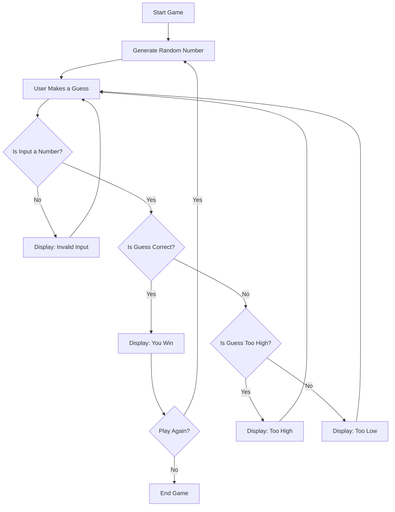

1. Start Game – The game begins running.

2. Generate Random Number – The program picks a number between 1-100
   
3. User Makes a Guess – The user is prompted to input a guess.

4. Is Input a Number? – The program checks if the input is a valid number:

5. If no, it displays an "Invalid Input" message and asks for a new guess.

6. If yes, it proceeds to check the guess against the random number.
7. Is Guess Correct? – If the guess matches the random number:

8. Show a “You Win” message and offer the option to play again.

9. If incorrect, determine whether it’s too high or too low. (system response) 

 Is Guess Too High? – If yes, show “Too High” and loop back for another guess.
 Is Guess Too Low? – If yes, show “Too Low” and loop back for another guess.

Display: You Win – Shown when the user guesses correctly.

10. Play Again? (user choice)  – After a correct guess:

If yes, restart by generating a new number. If no, end the game.

End Game – The game ends.
