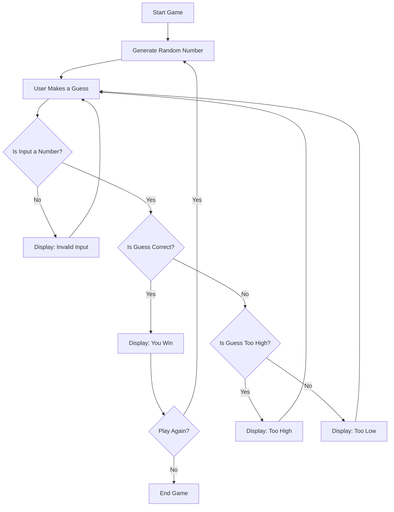

```mermaid
flowchart TD
    A[Start Game] --> B[Generate Random Number]
    B --> C[User Makes a Guess]
    C --> V{Is Input a Number?}
    V -- No --> X[Display: Invalid Input] --> C
    V -- Yes --> D{Is Guess Correct?}
    D -- Yes --> E[Display: You Win]
    E --> P{Play Again?}
    P -- Yes --> B
    P -- No --> I[End Game]
    D -- No --> F{Is Guess Too High?}
    F -- Yes --> G[Display: Too High] --> C
    F -- No --> H[Display: Too Low] --> C
```
