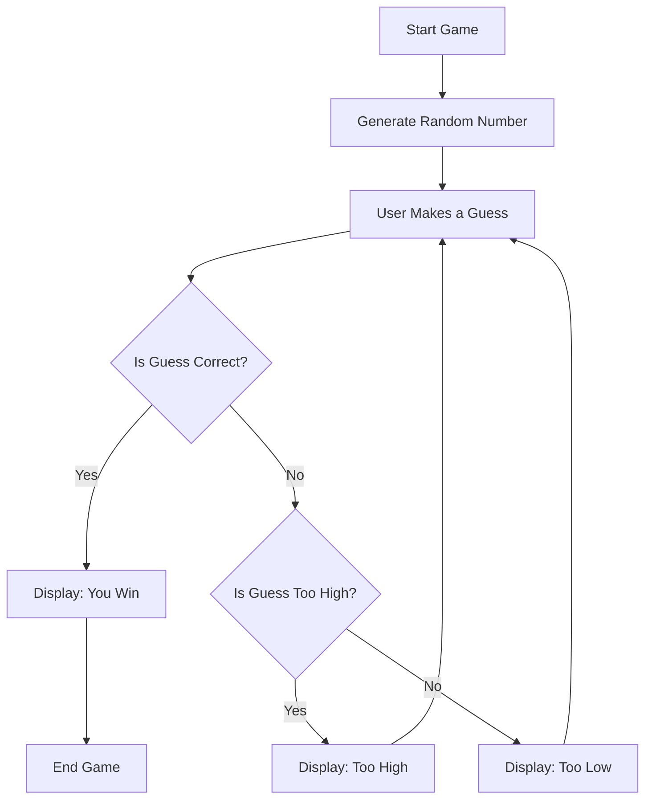

```mermaid
flowchart TD
    A[Start Game] --> B[Generate Random Number]
    B --> C[User Makes a Guess]
    C --> D{Is Guess Correct?}
    D -- Yes --> E[Display: You Win]
    D -- No --> F{Is Guess Too High?}
    F -- Yes --> G[Display: Too High]
    F -- No --> H[Display: Too Low]
    G --> C
    H --> C
    E --> I[End Game]
```
